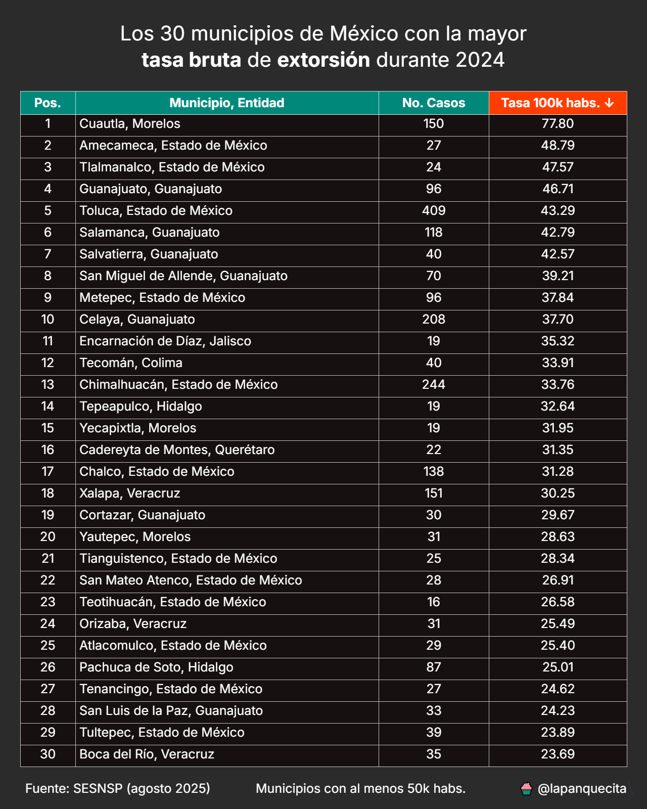
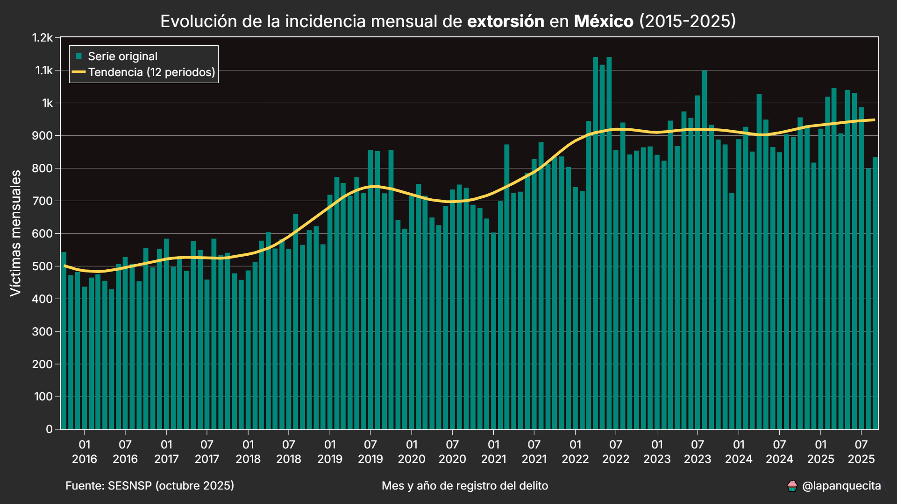

## Conjuntos de datos

El SESNSP publica tres bases de datos principales sobre incidencia delictiva:

* **Estatal:** Carpetas de investigación agregadas por entidad federativa.
* **Municipal:** Igual que el dataset estatal, pero con mayor desagregación (nivel municipal).
* **Víctimas:** Datos sobre el número de víctimas, con variables adicionales como sexo y grupo de edad. Esta base tiene un catálogo de delitos más reducido y cifras más altas, ya que se contabilizan víctimas y no carpetas.

## Scripts incluidos

A continuación se describe la función de cada uno de los scripts disponibles en este repositorio.

### `timeseries_converter.py`

Convierte los datasets originales del SESNSP a un formato de series de tiempo. En su forma original, cada mes es una columna, lo que dificulta el análisis. Este script simplifica esa estructura para facilitar el filtrado y el trabajo con fechas.

### `alto_impacto.py`

Genera gráficas de línea que muestran la evolución mensual de 12 delitos de alto impacto a lo largo de un año. Se incluye una línea adicional con la tendencia para facilitar la interpretación de tendencias.

## top10.py

Este script calcula las tasas de incidencia de 13 delitos para cada una de las entidades de México.

Dependiendo del modo del script "top|bottom" se muestran las 10 entidades con mayor|menor tasa.

## municipal.py

Este script puede generar un mapa choropleth con la incidencia delictiva por municipio.

Así mismo, se pueden generar tablas desglosando los 30 municipios con la mayor incidencia o tasa ajustada por población.

## victimas.py

Este script hace uso exclusivo del dataset de víctimas para obtener tendencias y generar visualizaciones más detalladas.

Se pueden generar tasas anuales para cada una de las entidades o anivel ancional.

Así mismo, se puede conocer la tendencia mensual por entidad y tipo de delito.

La siguiente gráfica de barras es particulamernte efectiva para conocer cambios relativos para cada entidad.

El siguiente mapa y tabla son de especial utilidad para mostrar un panorama completo.

Las víctimas se desglosan por entidad y sexo, así como sus tasas por cada 100,000 habitantes. Esto elimina cualquier posibilidad de cesgo o ambigüedad.

Finalmente, tenemos una opción adicional de explorar los delitos por sexo.

Esta gráfica de barras hace un desglose por proporción, facilitando la comparación por entidad.

## Consideraciones adicionales

* Las tasas de incidencia se calculan utilizando las estimaciones de población del CONAPO, disponibles en la carpeta `assets/`.
* Estos scripts han sido utilizados para generar contenido en redes sociales, con buena recepción por parte del público.
* Aunque los datos del SESNSP tienen ciertas limitaciones en cuanto a detalle, permiten generar análisis valiosos y visualizaciones útiles.

## Conclusión

Este proyecto demuestra que, con un procesamiento adecuado, es posible obtener información relevante a partir de datos públicos sobre seguridad. La intención es facilitar el análisis, la visualización y la comprensión de la evolución delictiva en México.