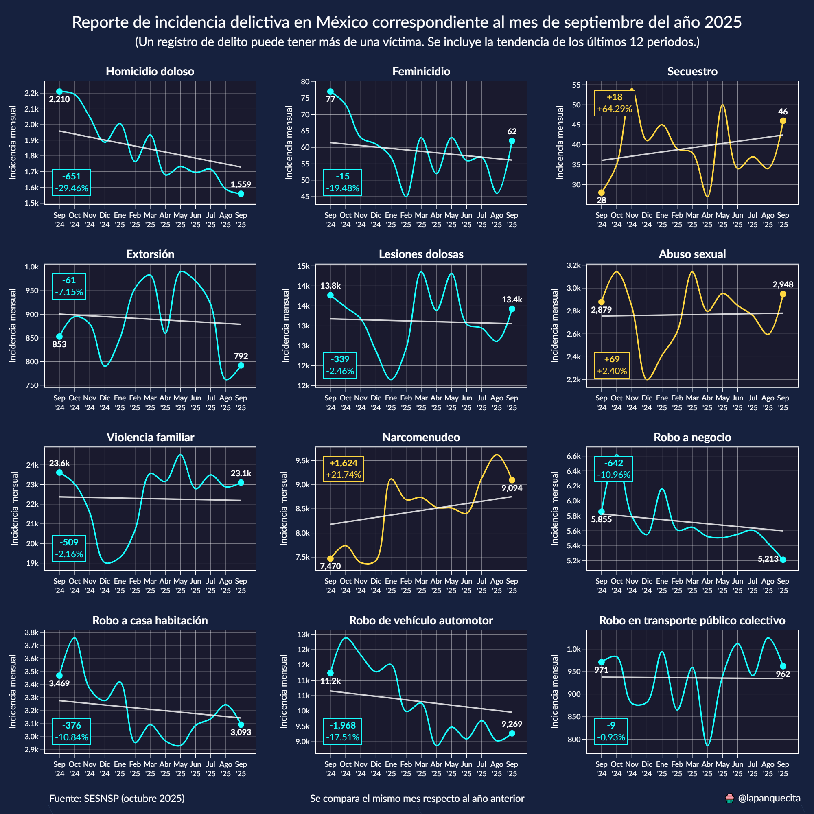
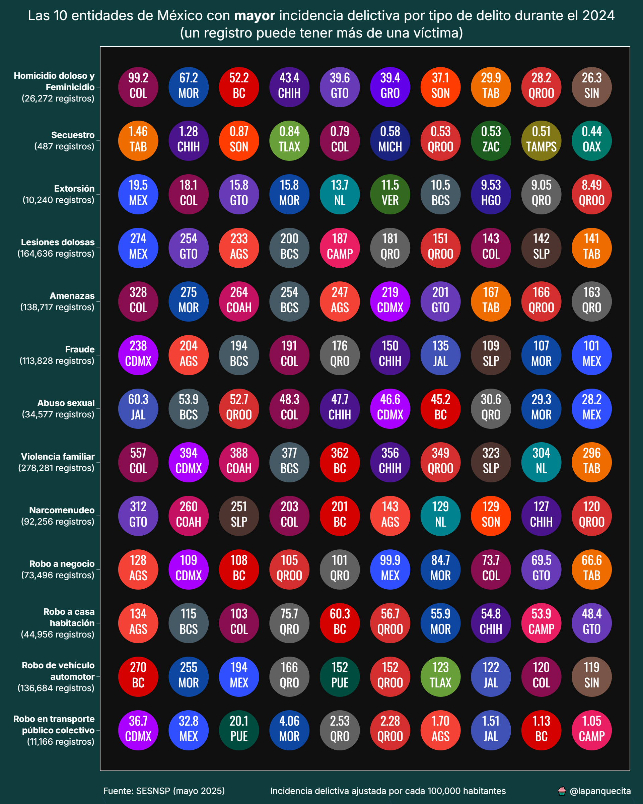
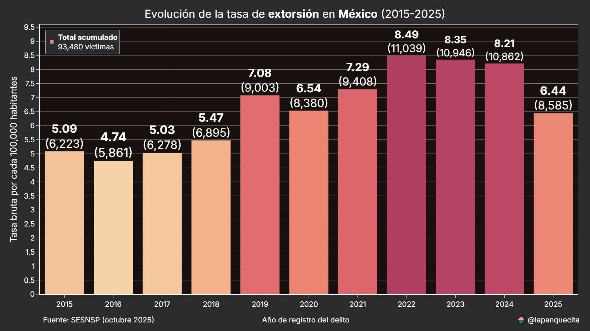

# Incidencia delictiva en México

En este repositorio se encuentran los scripts y datasets para analizar las cifras de incidencia delictiva proporcionadas por el SESNSP.

https://www.gob.mx/sesnsp/acciones-y-programas/datos-abiertos-de-incidencia-delictiva

El SESNSP cuenta con 3 datasets de incidencia delictiva:

* Estatal
* Municipal
* Víctimas

En el estatal y municipal se cuentan las carpetas de investigación de cada delito. Las cifras son las mismas, siendo la única diferencia el nivel de detalle.

En el caso del dataset de víctimas, este cuenta con un menor catálogo de delitos, las cifras son a nivel estatal, pero tiene más información, como el sexo y grupo de edad de la víctima. En este dataset se cuentan las víctimas y no las carpetas de investigación, por lo tanto, son cifras más altas.

A continuación voy a documentar de forma breve la función de cada script.

## timeseries_converter.py

Los datasets del SESNSP están en un formato algo complicado de usar ya que cada mes es una columna.

Este script transforma los datasets en un formato de series de tiempo, lo cual hace mucho más fácil poder filtrar la información.

## alto_inpacto.py

Este script crea una serie de gráficas de linea para mostrar la evolución de 12 delitos a lo largo de un año.

Cada delito cuenta con una linea adicional mostrando el promedio móvil.

## top10.py

Este script calcula las tasas de incidencia de 13 delitos para cada una de las entidades de México.

Dependiendo del modo del script "top|bottom" se muestran las 10 entidades con mayor|menor tasa.

## municipal.py

Este script puede generar un mapa choropleth con la incidencia delictiva por municipio.

También se puede usar para generar tablas con el top 30 de tasas de incidencia del delito especificado.

## victimas.py

Este script hace uso exclusivo del dataset de víctimas para obtener tendencias y generar visualizaciones más detalladas.

Se pueden generar tasas anuales para cada una de las entidades o anivel ancional.

Así mismo, se puede conocer la tendencia mensual por entidad y tipo de delito.

La siguiente gráfica de barras es particulamernte efectiva para conocer cambios relativos para cada entidad.

El siguiente mapa y tabla son de especial utilidad para mostrar un panorama completo.

Las víctimas se desglosan por entidad y sexo, así como sus tasas por cada 100,000 habitantes. Esto elimina cualquier posibilidad de cesgo o ambigüedad.

Finalmente, tenemos una opción adicional de explorar los delitos por sexo.

Esta gráfica de barras hace un desglose por proporción, facilitando la comparación por entidad.

## Conclusión

A pesar de que los datasets del SESNSP no contienen información muy detallada, aún se pueden obtener datos interesantes.

Estos scripts los he utilizado para generar contenido en mis redes sociales y han tenido buena aceptación.

Para calcular las tasas de incidencia utilicé las estimaciones de población del CONAPO, las cuales se encuentran en la carpeta `assets`.